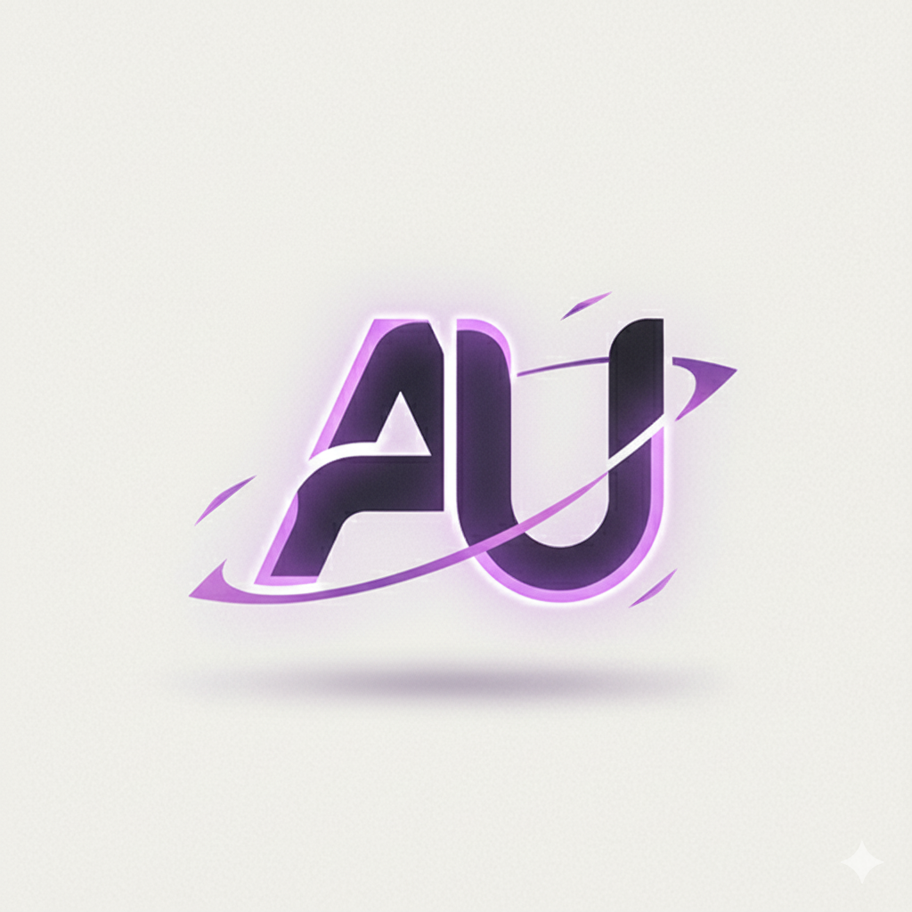

<div align="center">
  

  # 🌟 Aura UI

  **The Ultimate UI Component Library for Modern Web Development**

  *Beautiful, accessible, and production-ready components that accelerate your development workflow*

  [](https://www.npmjs.com/package/@rajdevxd/aura-ui)
  [](https://opensource.org/licenses/MIT)
  [](https://www.typescriptlang.org/)
  [](https://reactjs.org/)
  [](https://nextjs.org/)
  [](https://tailwindcss.com/)

  [📚 Documentation](https://aura-ui-xd.vercel.app) • [🚀 Live Demo](https://aura-ui-xd.vercel.app) • [💬 Discord](https://discord.gg/aura-ui) • [🐛 Issues](https://github.com/codewithevilxd/aura-ui/issues)

</div>

---

## ✨ Features

🎨 **37+ Beautiful Components** - Production-ready UI components with consistent design
⚡ **Lightning Fast** - Optimized performance with hardware acceleration
🎯 **TypeScript Support** - Full type safety and IntelliSense support
🌙 **Dark/Light Mode** - Built-in theme switching with next-themes
📱 **Responsive Design** - Mobile-first approach with Tailwind CSS
♿ **Accessibility** - WCAG compliant with keyboard navigation
🎭 **Smooth Animations** - Micro-interactions powered by Motion
🛠️ **CLI Tool** - Easy component installation and management
📚 **Comprehensive Docs** - Interactive examples and guides
🔧 **Backend Snippets** - Full-stack development utilities
🎪 **3D Effects** - Advanced animations and visual effects
📝 **Animated Text** - 10+ stunning text animation components

---

## 🚀 Quick Start

### Installation

```bash
# Using npm
npm install @rajdevxd/aura-ui

# Using yarn
yarn add @rajdevxd/aura-ui

# Using pnpm
pnpm add @rajdevxd/aura-ui
```

### CLI Setup

```bash
# Initialize Aura UI in your project
npx aura-ui init

# Add components to your project
npx aura-ui add button
npx aura-ui add card
npx aura-ui add modal
```

### Basic Usage

```tsx
import { Button, Card, Badge } from "@rajdevxd/aura-ui"

export default function App() {
  return (
    <div className="p-8">
      <Card className="p-6">
        <h1 className="text-2xl font-bold mb-4">Welcome to Aura UI</h1>
        <p className="text-muted-foreground mb-4">
          Build beautiful interfaces with ease
        </p>
        <div className="flex gap-2">
          <Button>Get Started</Button>
          <Badge variant="secondary">v1.0.11</Badge>
        </div>
      </Card>
    </div>
  )
}
```

---

## 🎨 Component Showcase

### 📱 UI Components (37+)

#### **Basic Components**
- **Button** - Multiple variants, sizes, and states
- **Input** - Form inputs with validation
- **Card** - Content containers with headers/footers
- **Badge** - Status indicators and labels
- **Avatar** - User profile images with fallbacks
- **Spinner** - Loading indicators
- **Alert** - Notification messages
- **Progress** - Progress bars and indicators

#### **Interactive Components**
- **Modal** - Dialog overlays with backdrop
- **Tooltip** - Hover information displays
- **Tabs** - Tabbed content navigation
- **Accordion** - Collapsible content sections
- **Dropdown** - Selection menus
- **Checkbox** - Form checkboxes
- **Radio** - Form radio buttons
- **Toggle** - Switch components
- **Pagination** - Page navigation controls

#### **Advanced Components**
- **Data Table** - Sortable, filterable tables
- **Form** - Complete form solutions
- **Search** - Search input with suggestions
- **Color Picker** - Color selection tool
- **File Upload** - Drag & drop file uploads
- **Rating** - Star rating components
- **Timeline** - Event timeline displays
- **Stepper** - Multi-step process indicators

### 🎭 3D Animated Components (5)

- **Floating Card** - Cards with floating animations
- **Morphing Button** - Shape-shifting buttons
- **Wave Text** - Text with wave animations
- **Particle Background** - Animated particle effects
- **Flip Card** - 3D card flip animations
- **Rotating Card** - Continuous rotation effects

### 📝 Animated Text Components (10)

- **Typewriter Text** - Realistic typing effects
- **Glitch Text** - Cyberpunk RGB distortions
- **Rainbow Text** - Smooth color gradients
- **Shimmer Text** - Metallic light effects
- **Neon Text** - Retro neon glow
- **Gradient Text** - Animated color shifts
- **Fade In Text** - Directional fade animations
- **Bounce Text** - Playful bouncing letters
- **Typing Text** - Multi-text cycling
- **Liquid Text** - Organic flow effects

### 🏗️ Blocks (Pre-built Sections)

- **Hero Section** - Landing page headers
- **Sign In Form** - Authentication forms
- **Sign Up Form** - Registration forms
- **Accordion Block** - FAQ sections
- **Testimonials** - Customer reviews
- **Features** - Product features showcase

### 🔧 Backend Snippets

- **API Response** - Standardized API responses
- **API Error** - Error handling utilities
- **Nodemailer** - Email sending utilities
- **Express Setup** - Express.js configuration

---

## 🎯 Key Features

### ⚡ Performance Optimized
- Hardware-accelerated animations
- Lazy loading components
- Optimized bundle sizes
- Minimal runtime overhead

### 🎨 Design System
- Consistent spacing and typography
- Unified color palette
- Standardized component APIs
- Responsive design patterns

### 🔧 Developer Experience
- Full TypeScript support
- Comprehensive documentation
- Interactive playground
- CLI tool for easy setup

### 🌍 Browser Support
- Modern browsers (Chrome, Firefox, Safari, Edge)
- Mobile browsers (iOS Safari, Chrome Mobile)
- Progressive enhancement
- Graceful degradation

---

## 📚 Documentation

### Getting Started
1. [Installation Guide](https://aura-ui-xd.vercel.app/docs/getting-started/installation)
2. [Configuration](https://aura-ui-xd.vercel.app/docs/getting-started/configuration)
3. [Theme Setup](https://aura-ui-xd.vercel.app/docs/getting-started/theming)

### Component Documentation
- [Component API Reference](https://aura-ui-xd.vercel.app/docs/components)
- [Interactive Examples](https://aura-ui-xd.vercel.app/docs/examples)
- [Best Practices](https://aura-ui-xd.vercel.app/docs/best-practices)

### Advanced Features
- [Custom Theming](https://aura-ui-xd.vercel.app/docs/theming)
- [Animation System](https://aura-ui-xd.vercel.app/docs/animations)
- [Accessibility Guide](https://aura-ui-xd.vercel.app/docs/accessibility)

---

## 🛠️ CLI Tool

### Installation
```bash
npm install -g aura-ui-cli
# or
npx aura-ui-cli
```

### Commands

```bash
# Initialize project
aura-ui init

# Add components
aura-ui add button
aura-ui add card modal

# List available components
aura-ui list

# Update components
aura-ui update

# Remove components
aura-ui remove button
```

### Package Manager Support
- ✅ npm
- ✅ yarn
- ✅ pnpm
- ✅ bun

---

## 🎨 Theming

### Built-in Themes
```tsx
import { ThemeProvider } from "@rajdevxd/aura-ui"

export default function App() {
  return (
    <ThemeProvider defaultTheme="light">
      <YourApp />
    </ThemeProvider>
  )
}
```

### Custom Themes
```css
/* styles/globals.css */
:root {
  --primary: 220 70% 50%;
  --secondary: 220 13% 91%;
}

[data-theme="dark"] {
  --primary: 210 40% 60%;
  --secondary: 220 13% 14%;
}
```

### CSS Variables
- `--primary` - Primary brand color
- `--secondary` - Secondary color
- `--accent` - Accent color
- `--muted` - Muted text color
- `--border` - Border colors
- `--radius` - Border radius values

---

## 🚀 Advanced Usage

### Server Components (Next.js 13+)
```tsx
// app/layout.tsx
import { ThemeProvider } from "@rajdevxd/aura-ui"

export default function RootLayout({ children }) {
  return (
    <html lang="en">
      <body>
        <ThemeProvider>
          {children}
        </ThemeProvider>
      </body>
    </html>
  )
}
```

### Custom Component Variants
```tsx
import { cva } from "class-variance-authority"

const buttonVariants = cva("button", {
  variants: {
    variant: {
      primary: "bg-blue-500 text-white",
      secondary: "bg-gray-500 text-white",
    },
    size: {
      small: "px-2 py-1 text-sm",
      large: "px-6 py-3 text-lg",
    }
  }
})
```

### Animation Integration
```tsx
import { motion } from "motion/react"
import { Button } from "@rajdevxd/aura-ui"

export function AnimatedButton() {
  return (
    <motion.div whileHover={{ scale: 1.05 }}>
      <Button>Hover me!</Button>
    </motion.div>
  )
}
```

---

## 📊 Project Structure

```
aura-ui/
├── packages/
│   ├── cli/                 # CLI tool
│   └── core/                # Core library
├── registry/
│   ├── components/          # UI components
│   ├── blocks/             # Pre-built sections
│   └── backend-snippets/   # Backend utilities
├── content/
│   ├── docs/               # Documentation
│   └── components/         # Component showcases
├── src/
│   ├── app/                # Next.js app
│   ├── components/         # Demo components
│   └── lib/                # Utilities
└── public/                 # Static assets
```

---

## 🤝 Contributing

We welcome contributions! Here's how you can help:

### Development Setup
```bash
# Clone the repository
git clone https://github.com/codewithevilxd/aura-ui.git
cd aura-ui

# Install dependencies
npm install

# Start development server
npm run dev

# Run tests
npm run test

# Build for production
npm run build
```

### Contribution Guidelines
- Follow the existing code style
- Add tests for new features
- Update documentation
- Use conventional commits

### Component Development
```bash
# Create new component
npm run create-component MyComponent

# Add component to registry
npm run add-to-registry MyComponent

# Generate documentation
npm run generate-docs
```

---

## 📈 Roadmap

### Version 1.1.0 (Coming Soon)
- [ ] More animated components
- [ ] Advanced form components
- [ ] Chart and data visualization
- [ ] Internationalization support

### Version 1.2.0 (Future)
- [ ] Component marketplace
- [ ] Theme builder tool
- [ ] Design system generator
- [ ] Mobile app components

### Community Requests
- ⭐ Star the repo to show support
- 🐛 Report bugs and issues
- 💡 Suggest new features
- 📖 Improve documentation

---

## 📄 License

**MIT License** - feel free to use this project for personal and commercial projects.

```text
Copyright (c) 2025 RAj (codewithevilxd)

Permission is hereby granted, free of charge, to any person obtaining a copy
of this software and associated documentation files (the "Software"), to deal
in the Software without restriction, including without limitation the rights
to use, copy, modify, merge, publish, distribute, sublicense, and/or sell
copies of the Software, and to permit persons to whom the Software is
furnished to do so, subject to the following conditions:

The above copyright notice and this permission notice shall be included in all
copies or substantial portions of the Software.
```

---

## 🙏 Acknowledgments

- **React** - The library that makes everything possible
- **Next.js** - The amazing framework powering this project
- **Tailwind CSS** - Utility-first CSS framework
- **Radix UI** - Accessible component primitives
- **Motion** - Animation library for React
- **TypeScript** - Type-safe JavaScript
- **Vercel** - Hosting and deployment platform

---

## 📞 Support

### Community
- **GitHub Issues** - Bug reports and feature requests
- **GitHub Discussions** - General questions and discussions
- **Discord Server** - Real-time chat with the community

### Professional Support
- **Email** - support@aura-ui-xd.vercel.app
- **Documentation** - Comprehensive guides and tutorials
- **Video Tutorials** - Step-by-step implementation guides

---

<div align="center">

  ### Made with ❤️ by [RAj](https://github.com/codewithevilxd)

  **"Building the future of web development, one component at a time"**

  ---

  [⬆️ Back to Top](#-aura-ui)

</div>
